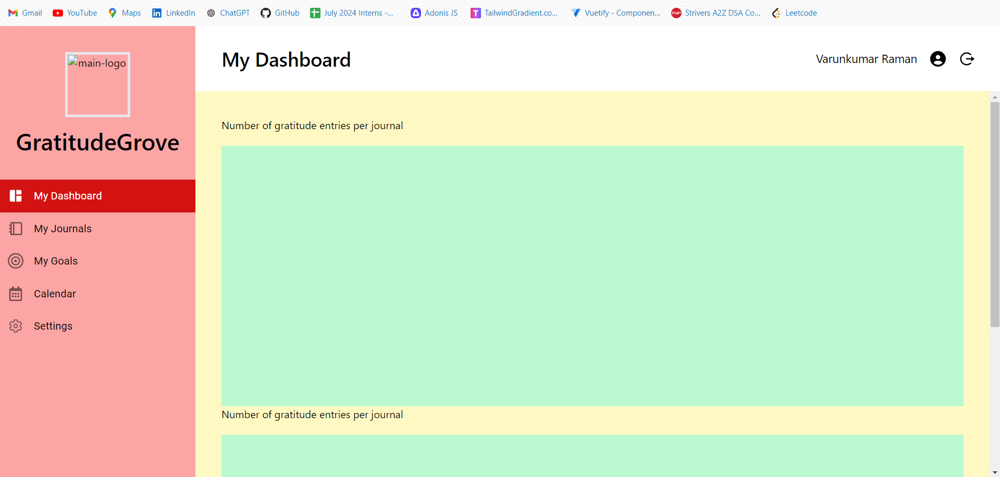
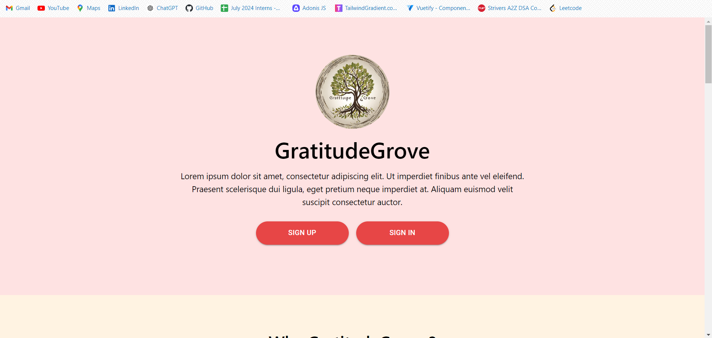
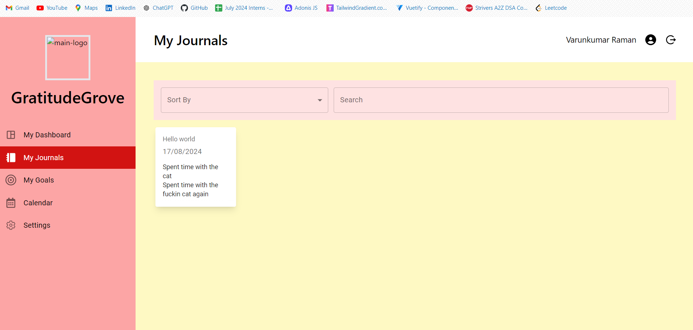

# Gratitude Grove - Frontend

## Overview

Gratitude Grove is a gratitude journaling web application designed to help users create daily journal entries, store previous entries, and manage their journaling activities. The application features a calendar to display progress, a dashboard with contribution graphs, and an appealing user interface.

The frontend development has begun but is not yet fully complete. The project aims to provide a user-friendly experience with several key features and plans for future enhancements.

## Pages

### Dashboard Page
Displays user statistics and contribution graphs, providing insights into the user’s journaling activity.

  
*Description:* The dashboard page showing user statistics and contribution graphs.

### Home Page
A landing page that highlights the features of the application and emphasizes the importance of gratitude journaling.

  
*Description:* The home page showcasing the application's features and the significance of gratitude journaling.

### Login-Register Page
Contains both login and registration components, allowing users to authenticate and create accounts.

  
*Description:* The login-register page with components for user authentication.

### Journals Page
Lists all journal entries with options to add new journals, and features for searching, sorting, and filtering entries based on various criteria.

  
*Description:* The journals page displaying a list of journal entries with options to add, search, sort, and filter.

## Features & Libraries Used

- **Material UI:**  
  Provides components and styling for the user interface.

- **Tailwind CSS:**  
  Used for custom styling and layout.

- **React Icons:**  
  For incorporating icons into the application.

- **React Router:**  
  Handles navigation between different pages of the application.

- **Axios:**  
  Used for making API calls to interact with the backend.

## Future Enhancements

The following features are planned for future implementation:

- Display all journals.
- Integration with backend APIs.
- CRUD operations for managing journal entries.
- Calendar view to display all journal entries.
- Statistics visualization using graph libraries.

## Contribution

Feel free to use, modify, and contribute to this project. Your contributions are welcome!

1. Fork the repository.
2. Create a new branch (`git checkout -b feature-branch`).
3. Make your changes.
4. Commit your changes (`git commit -m 'Add new feature'`).
5. Push to the branch (`git push origin feature-branch`).
6. Open a pull request.

## License

This project is open-source and free to use under the MIT License.

## Acknowledgements

- **Material UI** for providing a robust set of components.
- **Tailwind CSS** for flexible and responsive styling.
- **React Router** for seamless navigation.
- **Axios** for handling API requests.

Feel free to explore the project, and contribute if you have any ideas or improvements!
